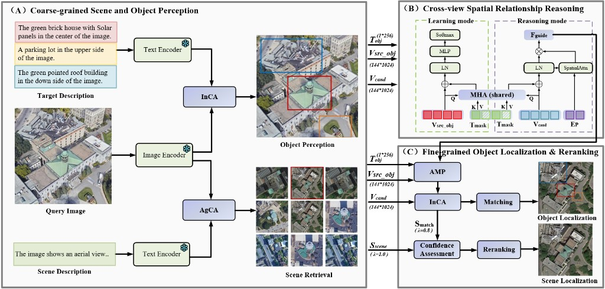

# GEOMATCH

# GeoMatch

Cross-view Spatial Relation Matching between Natural Language and Aerial Imagery.

## Overview

GeoMatch is a reproduction of the GeoText-1652 benchmark for cross-view spatial relation matching. Given a natural language description describing spatial relations (e.g., "the building to the left of the tree"), the model identifies the corresponding spatial location in aerial/satellite imagery.



## Benchmark

- **GeoText-1652**: A dataset with 1,652 image-text pairs for cross-view spatial relation understanding.
- **Tasks**: Spatial relation matching between natural language and aerial imagery.

## Model Architecture

The model adopts a cross-modal architecture:
- **Visual Encoder**: Swin Transformer / CLIP ViT / ViT
- **Text Encoder**: BERT / RoBERTa
- **Cross-modal Alignment**: X-VLM framework

## Setup

### Environment

```bash
conda create -n geomatch python=3.8
conda activate geomatch
pip install -r requirements.txt
```

### Dependencies

See `requirements.txt` for detailed dependencies.

## Dataset

The GeoText-1652 dataset can be downloaded from [project page](link).

```
dataset/
├── images/           # Aerial imagery
├── annotations/     # Text descriptions and bounding boxes
└── splits/          # Train/val/test splits
```

## Training

```bash
python run.py --config config.yaml
```

### Training Options

Configure training parameters in `config.yaml` or via command line arguments.

## Evaluation

```bash
python match_eval.py --checkpoint path/to/checkpoint
```

## Project Structure

```
├── models/                    # Model architectures
│   ├── xvlm.py               # X-VLM cross-modal model
│   ├── swin_transformer.py   # Swin Transformer
│   ├── clip_vit.py           # CLIP ViT
│   ├── vit.py                # Vision Transformer
│   ├── xbert.py              # BERT module
│   ├── xroberta.py           # RoBERTa module
│   ├── model_match.py        # Matching model
│   └── model_re_bbox.py      # Relation extraction model
├── dataset/                    # Data loading
│   ├── bbox_match_dataset.py  # Bounding box matching dataset
│   └── re_bbox_dataset.py     # Relation extraction dataset
├── configs/                    # Configuration files
│   ├── text2match.yaml        # Text-to-match config
│   └── re_bbox.yaml           # Relation extraction config
├── utils/                      # Utility functions
│   ├── checkpointer.py        # Model checkpointing
│   └── cider/                 # CIDEr evaluation
├── accelerators/               # Training accelerators
├── run.py                      # Main entry point
├── config.yaml                 # Global config
└── README.md                   # This file
```


## License

Apache License 2.0 - See `LICENSE` file.
